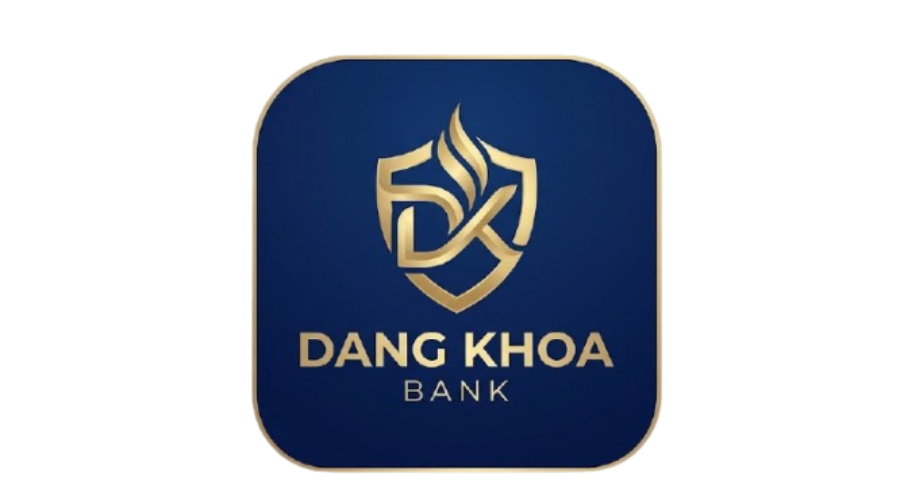

# Đăng Khoa Bank

Đăng Khoa Bank is a professional, production-ready desktop banking application built with **Python** and **PyQt6**. It features a modern fintech-style user interface, a robust local database system, and comprehensive administrative tools.

## Project Overview

Đăng Khoa Bank provides a secure and intuitive platform for personal financial management. The application focuses on high-performance data processing, atomic transaction safety, and a premium user experience.

- **Main Purpose:** Personal banking and financial tracking.
- **Fintech Focus:** Modern digital banking aesthetics with real-time analytics.
- **Concept:** A feature-rich desktop application for secure offline-first banking management.

## Main Features

### User Features
- **Secure Authentication:** Multi-factor verification simulation and session management.
- **Wallet Management:** Real-time balance tracking and virtual bank cards.
- **Transfer System:** Secure internal transfers with receiver name resolution and digital receipts.
- **QR Payment System:** Scan and parse QR codes for automated transfer filling.
- **Savings System:** Multiple savings plans with progress tracking and interest simulation.
- **Transaction History:** Detailed logs with search and filtering capabilities.
- **Advanced Analytics:** Interactive charts for spending and savings growth.
- **Customization:** Full support for Dark/Light modes and multi-language (Vietnamese/English).

### Admin Features
- **Analytics Dashboard:** Enterprise-level overview of system-wide statistics and trends.
- **User Management:** Full control over user accounts, tiers, and statuses.
- **Transaction Monitoring:** Real-time auditing of all system transactions.
- **Security Center:** Fraud monitoring, risk distribution tracking, and system health checks.
- **System Announcements:** Manage global notifications for all users.
- **Backup & Recovery:** Database maintenance and snapshot management.

## UI/UX Features
- **Fintech Aesthetic:** Clean, minimalist design with professional cyan accents.
- **Animations:** Smooth transitions and interactive feedback for a modern feel.
- **Responsive Layout:** Optimized for various resolutions (1366x768 to 2K+).
- **Custom Components:** Handcrafted widgets, tables, and interactive charts.
- **Digital Receipts:** Visual UI bills with the ability to export as images.

## Project Structure

```text
src/
 ├── admin/         # Admin panel UI, tabs, and administrative services
 ├── assets/        # Graphical assets (logos, images, icons)
 ├── core/          # Core engine: theme, language, stabilizers, and utils
 ├── database/      # SQLite schema, connection management, and migrations
 ├── design/        # Design system: tokens, spacing, and component factory
 ├── models/        # Data models and structures
 ├── security/      # Auth guards, security rules, and manager
 ├── services/      # Business logic: transfers, savings, QR, and analytics
 └── ui/            # Main application UI: windows, tabs, and components
```

## Architecture Overview

The application follows a modular service-oriented architecture:

```text
UI Layer (PyQt6)
      ↓
Service Layer (Business Logic)
      ↓
Database Layer (SQLite + WAL)
      ↓
Security Layer (Auth & Guards)
```

## Technologies Used
- **Python:** Core application logic.
- **PyQt6:** High-performance GUI framework.
- **SQLite:** Local database with **WAL (Write-Ahead Logging)** mode for high concurrency.
- **Qt Charts / QPainter:** Custom interactive data visualizations.
- **QSS:** Advanced styling for a consistent fintech look.
- **Pathlib:** Robust file path management.

## Database System
- **SQLite Storage:** Local-first data management with atomic transactions.
- **Transaction Safety:** Implements rollback protection and write-ahead logging to prevent data corruption.
- **Optimized Performance:** Database-level connection timeouts and optimized pragmas for low latency.

## Security Features
- **Authentication:** Secure login flow with session timeout protection.
- **Validation:** Strict data validation for all financial operations.
- **Audit Logs:** Full system-wide auditing for administrative oversight.
- **PIN Verification:** Secondary security layer for critical transactions.

## Savings & Analytics
- **Simulation Engine:** Real-time calculation of interest growth and progress.
- **Analytics Service:** Aggregates transaction data into visual growth charts.
- **Goal Tracking:** Visual progress bars and milestone indicators for savings goals.

## QR Payment System
- **QR Parsing:** Decodes internal payment QR codes to extract account details.
- **Automated Workflow:** Auto-fills transfer forms to reduce manual input errors.

## Installation Guide

### Prerequisites
- Python 3.9+
- pip (Python package manager)

### Setup
1. Clone the repository:
   ```bash
   git clone https://github.com/your-repo/dang-khoa-bank.git
   cd dang-khoa-bank
   ```
2. Install dependencies:
   ```bash
   pip install PyQt6 qrcode pillow
   ```
3. Run the application:
   ```bash
   python src/main.py
   ```

## Screenshots

### Login UI


### User Dashboard
*(Dashboard Overview showing Wallet and Transactions)*

### Admin Dashboard
*(Enterprise Analytics and User Monitoring)*

### Savings System
*(Progress Tracking and Interest Growth)*

## Future Improvements
- **AI Fraud Detection:** Machine learning integration for detecting suspicious patterns.
- **Cloud Synchronization:** Optional encrypted cloud backups for cross-device access.
- **Advanced Reporting:** Exporting financial reports in PDF and Excel formats.
- **Mobile Companion:** Cross-platform companion app for mobile notifications.

## Contributing
Professional contributions are welcome. Please read the contributing guidelines before submitting pull requests.

## License
This project is licensed under the **MIT License**.
